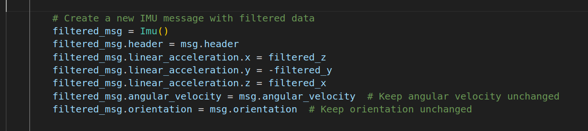
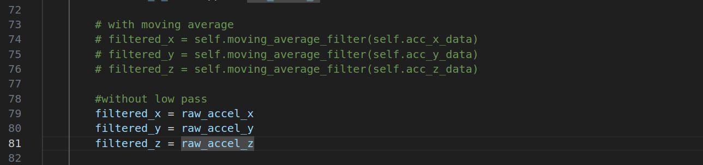
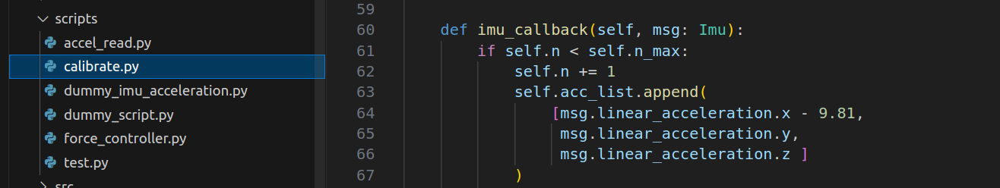

# Prototype of the system simulating the force acting on the object, referring to the force from the IMU Sensor value.

This repository focuses on developing firmware and implementing signal-processing filters for the STM32 G474RE microcontroller. The goal is to accurately measure and analyze three-axis inertial data (X, Y, and Z) to support simulation in gazebo.

# Table of Contents


# User installation guide 

## Prerequisites

Ensure you have the following dependencies installed

**Hardware Require**
- `STM32 G474RE`
- `MPU6050`

**Middle ware**
- `ROS2 Humble`
- `MicroRos`

**Applications**
- `Gazabo` 
- `STM32CubeIDE`

**

## Install project workspace
Clone this workspace

```bash
git clone https://github.com/DenWaritthon/imu_force_ws.git -b main
```

# Methodology

## IMU filter
- **Moving Average Algorithm:**  
  A custom node applies a moving average filter to the raw IMU data. This technique helps reduce noise and improve the quality of the measured signals.  
- **Modularity & Extensibility:**  
  The filtering implementation is modular, allowing for the easy integration of additional filters or algorithms in the future.

## Newton's equations

Convert the velocity obtained from the IMU into a force to apply to the object in Guzabo using Newton's equations.
```math
\sum F = ma
```

Given
- $F$ is the force to be obtained
- $m$ is the weight of the actual object, which weighs **xx kg. แก้ใน code ด้วย**
- $a$ is the acceleration measured by the IMU


# System architecture 


System separate the work into sub-node that work differently 6 node consist of

- IMU_Node (Micro ROS) is a node that have input value from IMU and Pub the value to Topic : /IMU_data to the node IMU_calibrate_node and lowpass_accel_collector_node.

- IMU_calabrate_node is a Node that have input value from IMU_node (Micro ROS) to Calibrate value of the IMU to make it more accurate.

- lowpass_accel_collector_node is a Node that have a input value from IMU_node (Micro Ros) after Calibate the value then the accelerate value by Pub Topic : /acceleration to Node Force_control_node.

- Force_control_node is a Node that get input of accelerate value from Node : lowpass_accel_collector_node to calculate in Newton's equations to control Object by Servive :/apply_link_wrench of Gazebo.

- distance_gazebo_node is a Node that have input value from Node : Gazebo_node to calculate distance and displacement origin to Object.

- dummy_imu_acceleration is a Node that is for testing of  Force_control_node that control Object of Gazebo.

- Gazebo_node is a Node of  Gazebo program that will be display result of the system that have Topic : /Odom for display the position of the Object on Ground_truth.
  
# User guide

After Clone workspace then Build and source

```bash
cd imu_force_ws/
colcon build
source install/setup.bash
```

## How to use simulation

Run the simulation in ROS2

**Run controller system**

``` bash
ros2 launch imu_force_gazebo sim.launch.py
```

**Run imu calibration**

```bash
ros2 run imu_calibration calibrate.py
```

**Run imu publisher**
```bash
ros2 run imu_calibration controller_node.py
```

### Config IMU 
Able to edit the axis of the IMU (In case of that you want to rotate the axis)



And able to choose from this two option below
- raw – bias
- moving average
By comment the code
And after that you need to colcon build to build the project so the project can be work properly

   

If calibrate and the value  is not  0 you need to configuration the gravity according to the axis set as well



If you make any changes, don't forget to run `colcon build` again.

# Demos and Result


# Conclusion
Simulation the movement of the human arm using ROS2 Humble and use various python libraries for instance roboticstoolbox, spatialmath, numpy, scipy and pygame for the user interface. This simulation simulate the human arm from the shoulder to the wrist. And 3D visualized by RVIZ in ROS2 that can control manually by input or using the user interface for the easier use.
\
But the thing that we have not been done is Test and Validate compare to the real human arm so it will be in our future plans.  

# Future plan
- Explore advanced filtering algorithms (e.g., Kalman filters) for improved accuracy and robustness.
- Expand documentation and provide example code to facilitate integration into larger robotics or control systems.

   
# Developer Member

- Waritthon Kongnoo
- Kraiwich Vichakhot
- Chayanin Napia